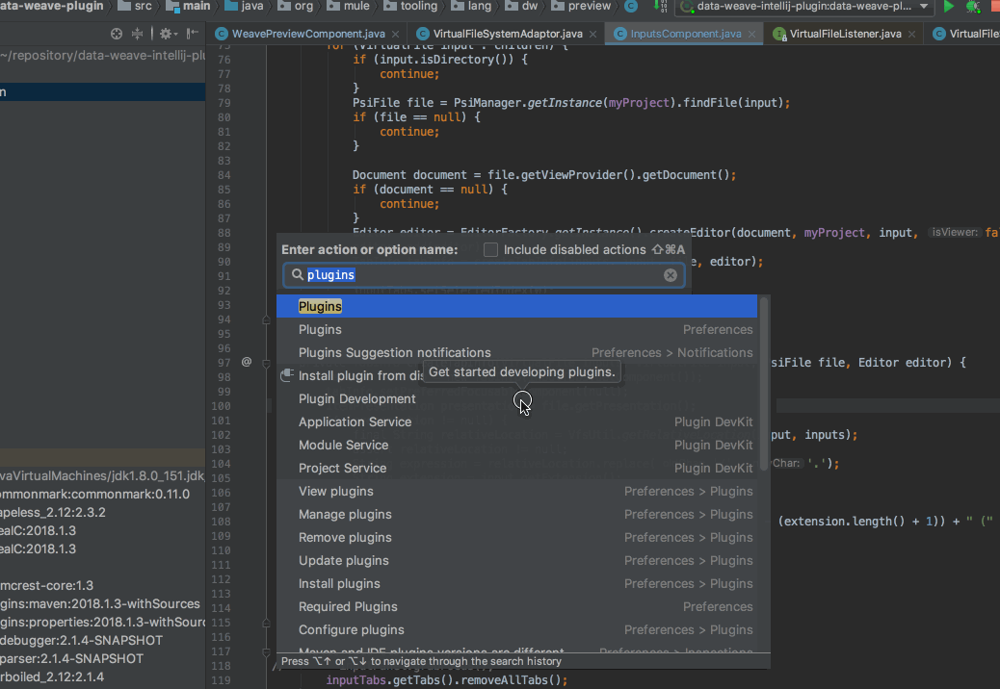

# data-weave-intellij-plugin
An intellij plugin that adds support for DataWeave 2.0 

## This initial version supports

* Local refactor
* Syntax highlighting
* Show structure <ctrl + 12>
* Mule Xml language injection
* String interpolation
* Run a script and debug it

## To build the plugin
```
./gradlew buildPlugin
```

## To install the nightly plugin

1. Go to **Settings/Preferences > Plugins > Browse repositories > Manage repositories**
2. Add the URL: https://plugins.jetbrains.com/plugins/Develop/10362
3. Search for **DataWeave 2.0 Intellij Plugin**
4. Install & restart


